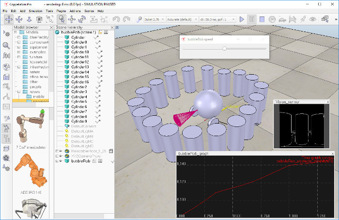
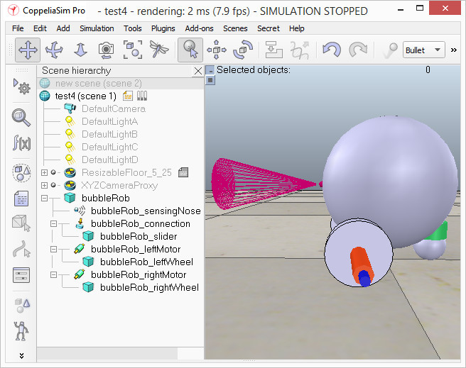

# Навчальний посібник BubbleRob #
Цей посібник допоможе ознайомитись з усіма функціями CoppeliaSim під час розробки простого мобільного робота *BubbleRob*. Файл сцени CoppeliaSim, пов’язаний із цим матеріалом, знаходиться в *scenes/tutorials/BubbleRob*. Наступний малюнок ілюструє сцену моделювання, яку ми розробимо:

Оскільки цей посібник охоплюватиме багато різних аспектів, не забудьте також переглянути інші, головним чином про створення імітаційної моделі. Перш за все, заново запустіть CoppeliaSim. Симулятор відображає стандартну сцену. Ми почнемо з тіла *BubbleRob*.

Ми додаємо примітивну сферу діаметром 0,2 до сцени за допомогою [Рядок меню --> Додати --> Примітивна форма --> Сфера]. Налаштовуємо елемент **X-size** на 0,2, потім натискаємо **OK**. Створена сфера з’явиться на шарі видимості 1 за замовчуванням і буде динамічною та відповідальною (оскільки ми залишили ввімкненим пункт **Створити динамічну та чуйну форму**). Це означає, що тіло *BubbleRob* буде падати та зможе реагувати на зіткнення з іншими відповідними формами (тобто змодельованими фізичним механізмом). Ми бачимо, що це властивості динаміки форми: увімкнено елементи **Body is respondable** і **Body is dynamic**. Ми починаємо симуляцію (за допомогою кнопки на панелі інструментів або натисканням <control-space> у вікні сцени) і копіюємо та вставляємо створену сферу (за допомогою [Панель меню --> Редагувати --> Копіювати вибрані об’єкти], а потім [Рядок меню --> Редагувати -> Вставити буфер] або за допомогою <control-c>, потім <control-v>): дві сфери реагуватимуть на зіткнення та відкотяться. Ми зупиняємо симуляцію: дубльована сфера буде автоматично видалена. Цю типову поведінку можна змінити в діалоговому вікні симуляції.
 
Ми також хочемо, щоб тіло *BubbleRob* можна було використовувати іншими модулями обчислення (наприклад, обчислення відстані). З цієї причини ми вмикаємо зіткнення, вимірювання та виявлення у загальних властивостях об’єкта для цієї форми, якщо вони ще не ввімкнені. Тепер за бажанням ми могли б змінити візуальний вигляд нашої сфери у властивостях форми.

Тепер ми відкриваємо діалогове вікно позиції на вкладці **переміщення**, вибираємо сферу, що представляє тіло *BubbleRob*, і вводимо 0,02 для **Along Z**. Переконаємося, що **Relative to**-item встановлено на **World**. Потім ми натискаємо **Перемістити виділення**. Це переміщує всі вибрані об’єкти на 2 см уздовж абсолютної осі Z і фактично трохи підняло нашу сферу. В ієрархії сцени ми двічі клацаємо псевдонім сфери, щоб мати змогу редагувати його. Вводимо *bubbleRob* і натискаємо enter.

Далі ми додаємо датчик наближення, щоб *BubbleRob* знав, коли він наближається до перешкод: ми вибираємо [Рядок меню --> Додати --> Датчик наближення --> Тип конуса]. У діалоговому вікні орієнтації на вкладці **Орієнтація** ми вводимо 90 для **Навколо Y** і **Навколо Z**, а потім натискаємо **Повернути виділення**. У діалоговому вікні позиції на вкладці позиції ми вводимо 0,1 для **X-coord**. і 0,12 для **Z-коорд**. Датчик наближення тепер правильно розташований відносно тіла *BubbleRob*. Ми двічі клацаємо піктограму датчика наближення в ієрархії сцени, щоб відкрити діалогове вікно властивостей. Ми натискаємо **Показати параметр об'єму**, щоб відкрити діалогове вікно об'єму датчика наближення. Ми регулюємо елементи **Offset** на 0,005, **Angle** на 30 і **Range** на 0,15. Потім у властивостях датчика наближення натискаємо **Показати параметри виявлення**. Відкриється діалогове вікно параметрів виявлення датчика наближення. Ми знімаємо позначку з пункту **Не дозволяти виявлення якщо відстань менша ніж** а потім знову закриваємо це діалогове вікно. В ієрархії сцен ми двічі клацаємо псевдонім датчика наближення, щоб відредагувати його. Вводимо *sensingNose* і натискаємо enter.

Ми вибираємо *sensingNose*, потім control-select *bubbleRob*, потім клацаємо [Рядок меню --> Редагувати --> Зробити останній вибраний об’єкт батьківським]. Це кріпить датчик до тіла робота. Ми також могли б перетягнути *sensingNose* на *bubbleRob* в ієрархії сцени. Ось що ми зараз маємо:

 
 
 [Датчик наближення, прикріплений до тіла bubbleRob]

Далі ми подбаємо про колеса *BubbleRob*. Ми створюємо нову сцену за допомогою [Рядок меню --> Файл --> Нова сцена]. Часто дуже зручно працювати з кількома сценами, щоб візуалізувати та працювати лише над окремими елементами. Додаємо примітивний циліндр з розмірами (0,08,0,08,0,02). Що стосується тіла *BubbleRob*, ми вмикаємо зіткнення, вимірювання та виявлення у загальних властивостях об’єкта для цього циліндра, якщо вони ще не ввімкнені. Потім ми встановлюємо абсолютну позицію циліндра (0,05,0,1,0,04), а його абсолютну орієнтацію (-90,0,0). Ми змінюємо псевдонім на *leftWheel*. Ми копіюємо та вставляємо колесо та встановлюємо абсолютну координату Y копії на -0,1. Перейменовуємо копію на *rightWheel*. Ми вибираємо два колеса, копіюємо їх, потім повертаємося до сцени 1 і вставляємо колеса.

Тепер нам потрібно додати шарніри (або двигуни) для коліс. Ми клацаємо [Рядок меню --> Додати --> З’єднання --> Поворот], щоб додати поворотне з’єднання до сцени. У більшості випадків, коли до сцени додається новий об’єкт, цей об’єкт з’являтиметься біля початку світу. Ми зберігаємо з’єднання вибраним, потім натискаємо клавішу Control і вибираємо *leftWheel*. У діалоговому вікні «Позиція» на вкладці **Позиція** ми натискаємо кнопку **Застосувати до вибору**: це розташовує з’єднання в центрі лівого колеса. Потім у діалоговому вікні орієнтації на вкладці **Орієнтація** ми робимо те саме: це орієнтує з’єднання так само, як і ліве колесо. Ми змінюємо назву суглоба на leftMotor. Тепер ми двічі клацаємо піктограму з’єднання в ієрархії сцени, щоб відкрити діалогове вікно властивостей з’єднання. Потім ми натискаємо **Показати динамічні параметри**, щоб відкрити діалогове вікно властивостей динаміки суглоба. Ми **вмикаємо двигун** і ставимо галочку біля пункту **Lock motor when target velocity нуль**. Тепер ми повторюємо ту саму процедуру для правого двигуна та перейменуємо його на *rightMotor*. Тепер ми прикріплюємо ліве колесо до лівого двигуна, праве колесо до правого двигуна, потім приєднуємо два двигуни до *bubbleRob*. Ось що ми маємо:

 
[Датчик наближення, двигуни та колеса]
 
Ми запускаємо симуляцію і помічаємо, що робот падає назад. Нам досі не вистачає третьої точки контакту з підлогою. Тепер ми додаємо маленький повзунок (або колесо). У новій сцені ми додаємо примітивну сферу з діаметром 0,05 і робимо сферу здатною до зіткнення, вимірювання та виявлення (якщо це ще не ввімкнено), а потім перейменуємо її на *slider*. Ми встановлюємо **Матеріал** на *noFrictionMaterial* у властивостях динаміки форми. Щоб жорстко зв’язати повзунок з рештою робота, ми додаємо об’єкт датчика сили за допомогою [Рядок меню --> Додати --> Датчик сили]. Перейменуємо його в *підключення* і зрушимо вгору на 0,05. Ми прикріплюємо повзунок до датчика сили, потім копіюємо обидва об’єкти, повертаємося до сцени 1 і вставляємо їх. Потім ми зміщуємо датчик сили на -0,07 вздовж абсолютної осі X, а потім прикріплюємо його до тіла робота. Якщо ми запустимо симуляцію зараз, то помітимо, що повзунок трохи рухається відносно тіла робота: це тому, що обидва об’єкти (тобто *slider* і *bubbleRob*) стикаються один з одним. Щоб уникнути дивних ефектів під час моделювання динаміки, ми маємо повідомити CoppeliaSim, що обидва об’єкти не стикаються між собою, і ми робимо це таким чином: у властивостях динаміки фігури для *slider* ми встановлюємо **локальну чуйну маску** на 00001111, а для *bubbleRob*, ми встановлюємо **локальну чуйну маску** на 11110000. Якщо ми знову запустимо симуляцію, ми помітимо, що обидва об’єкти більше не заважають. Ось що ми зараз маємо: 

 
 
 [Датчик наближення, двигуни, колеса та повзунок]

Ми запускаємо симуляцію ще раз і помічаємо, що *BubbleRob* трохи рухається, навіть із заблокованим двигуном. Ми також намагаємося запустити симуляцію з різними фізичними двигунами: результат буде іншим. Стабільність динамічного моделювання тісно пов’язана з масами та інерцією залучених нестатичних форм. Зараз ми намагаємося виправити цей небажаний ефект. Вибираємо два коліщатка та повзунок, а в діалоговому вікні динаміки фігури тричі клацаємо **M=M*2 (для вибору)**. Внаслідок цього маса всіх вибраних форм буде помножена на 8. Ми робимо те саме з інерціями 3-х вибраних форм, а потім знову запускаємо симуляцію - стабільність покращилася. У діалоговому вікні спільної динаміки ми встановили **Target velocity** 50 для обох двигунів. Ми запускаємо симуляцію: *BubbleRob* тепер рухається вперед і зрештою падає з підлоги. Ми скидаємо пункт **Target velocity** до нуля для обох двигунів.
 
Об’єкт *bubbleRob* є основою всіх об’єктів, які пізніше сформують модель *BubbleRob*. Модель ми визначимо трохи пізніше. Далі ми збираємося додати графічний об’єкт до *BubbleRob*, щоб відобразити його відстань. Клацніть [Рядок меню --> Додати --> Графік] і перейменуйте його на графік. Ми приєднуємо графік до *bubbleRob* і встановлюємо абсолютні координати графіка (0,0,0.005).
 
Тепер ми встановлюємо одну **Target velocity** двигуна на 50, запускаємо симуляцію та побачимо траєкторію *BubbleRob*, що відображається на сцені. Потім ми зупиняємо симуляцію та скидаємо цільову швидкість двигуна до нуля.
 
Додаємо примітивний циліндр з такими розмірами: (0,1, 0,1, 0,2). Ми хочемо, щоб цей циліндр був статичним (тобто на нього не впливала сила тяжіння чи зіткнень), але все ж мав певну реакцію на зіткнення з нестатичними фігурами. Для цього ми вимикаємо **Body is dynamic** у властивостях динаміки форми. Ми також хочемо, щоб наш циліндр можна було зіткнути, виміряти та виявити. Ми робимо це в загальних властивостях об’єкта. Тепер, поки циліндр все ще виділено, ми натискаємо кнопку панелі інструментів перекладу об’єкта:
 

 
Тепер ми можемо перетягувати будь-яку точку сцени: циліндр слідуватиме за рухом, але завжди буде змушений зберігати ту саму Z-координату. Копіюємо і вставляємо циліндр кілька разів і переміщуємо їх на позиції навколо *BubbleRob* (найзручніше це робити, дивлячись на сцену зверху). Під час переміщення об’єктів утримування клавіші shift дозволяє виконувати менші кроки переміщення. Утримуючи клавішу ctrl, можна рухатися в ортогональному напрямку до *звичайних* напрямків. Коли закінчите, знову натисніть кнопку панорамування камери на панелі інструментів:
 
Ми встановлюємо **Target velocity** 50 для лівого двигуна та запускаємо симуляцію: на графіку тепер відображається відстань до найближчої перешкоди, а сегмент відстані також видно на сцені. Ми зупиняємо симуляцію та скидаємо цільову швидкість до нуля.
 
Тепер нам потрібно закінчити **BubbleRob** як визначення моделі. Ми вибираємо базу моделі (тобто об’єкт *bubbleRob*), а потім у загальних властивостях об’єкта встановлюємо прапорець **Об’єкт є базою моделі**: тепер є пунктирна обмежувальна рамка, яка охоплює всі об’єкти в ієрархії моделі. Ми вибираємо два з’єднання, датчик наближення та графік, потім увімкніть пункт **Ігнорується обмежувальною рамкою моделі** та натискаємо **Застосувати до вибору** в тому самому діалоговому вікні: обмежувальна рамка моделі тепер ігнорує два з’єднання та датчик наближення. У тому самому діалоговому вікні ми вимикаємо **шар видимості камери** 2 і вмикаємо **шар видимості камери** 10 для двох з’єднань і датчика сили: це фактично приховує два з’єднання та датчик сили, оскільки шари 9-16 вимкнено за замовчуванням. У будь-який час ми можемо змінити шари видимості для всієї сцени. Щоб завершити визначення моделі, ми вибираємо датчик зору, два коліщатка, повзунок і графік, а потім увімкніть пункт **Вибрати базу моделі**. Якщо ми зараз спробуємо вибрати об’єкт у нашій моделі на сцені, уся модель замість цього буде вибрано, що є зручним способом обробки та маніпулювання цілою моделлю як одним об’єктом. Крім того, це захищає модель від ненавмисної зміни. Окремі об’єкти в моделі все ще можна вибрати на сцені, вибравши їх клацанням миші за допомогою Control-Shift або як зазвичай вибрати їх в ієрархії сцени. Нарешті ми згортаємо дерево моделі в ієрархії сцени.
 
Далі ми додаємо датчик зору в тому ж положенні та орієнтації, що й датчик наближення *BubbleRob*. Ми знову відкриваємо ієрархію моделі, потім клацаємо [Рядок меню --> Додати --> Датчик зору --> Тип перспективи], потім приєднуємо датчик зору до датчика наближення та встановлюємо локальне положення та орієнтацію датчика зору на (0,0,0). Ми також переконаємося, що датчик зору не є невидимим, не є частиною обмежувальної рамки моделі, і якщо натиснути на нього, замість нього буде вибрано модель. Для того щоб налаштувати датчик зору, ми відкриваємо діалогове вікно його властивостей. Ми встановлюємо для елемента **Далека площина відсікання** значення 1, а для елементів **Дозвіл x** і **Дозвіл y** — значення 256 і 256. Ми додаємо до сцени плаваючий вигляд, а над щойно доданим плаваючим видом клацніть правою кнопкою миші [Спливаюче меню --> Перегляд --> Зв’язати перегляд із вибраним датчиком зору] (ми переконаємося, що датчик зору вибрано під час цього процесу).
 
Ми приєднуємо дочірній сценарій до датчика зору, клацнувши [Рядок меню --> Додати --> Пов’язаний дочірній сценарій --> Безпотоковий]. Ми двічі клацаємо значок, який з’явився поруч із датчиком зору в ієрархії сцен: це відкриває дочірній сценарій, який ми щойно додали. Ми копіюємо та вставляємо наступний код у редактор скриптів, а потім закриваємо його:

 `function sysCall_vision(inData)
    simVision.sensorImgToWorkImg(inData.handle) -- copy the vision sensor image to the work image
    simVision.edgeDetectionOnWorkImg(inData.handle,0.2) -- perform edge detection on the work image
    simVision.workImgToSensorImg(inData.handle) -- copy the work image to the vision sensor image buffer
end`
