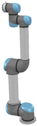
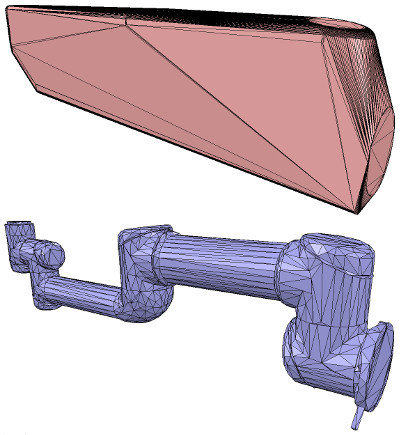
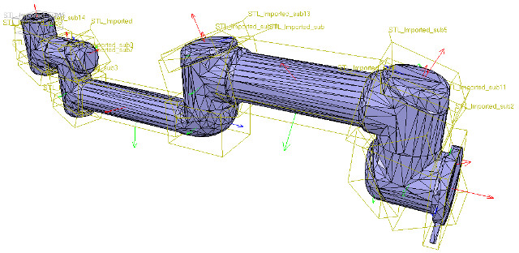
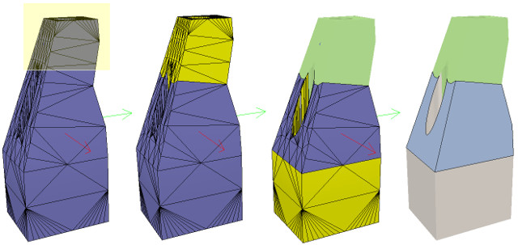

# Посібник зі створення чистої моделі #
Цей навчальний посібник допоможе вам крок за кроком створити чисту імітаційну модель робота чи будь-якого іншого предмета. Це дуже важлива тема, можливо, найважливіший аспект, щоб мати приємну на вигляд, швидку відображення, швидку симуляцію та стабільну імітаційну модель.
Щоб проілюструвати процес створення моделі, ми створимо наступний маніпулятор:

[Модель робота-маніпулятора]

## Побудова видимих фігур ##
Створюючи нову модель, спочатку ми обробляємо лише її візуальний аспект: динамічний аспект (його ще більш спрощена/оптимізована модель), з’єднання, датчики тощо буде розглянуто пізніше.

Тепер ми могли безпосередньо створювати примітивні форми в CoppeliaSim за допомогою [Рядок меню --> Додати --> Примітивна форма --> ...]. Роблячи це, ми маємо можливість створювати примітивні форми, або правильні форми. Примітивні фігури будуть оптимізовані для динамічної взаємодії, а також будуть безпосередньо активовані динамічно (тобто падіння, зіткнення, але це можна вимкнути на пізнішому етапі). Примітивні форми будуть простими сітками, які можуть містити недостатньо деталей або геометричної точності для нашого застосування. Іншим нашим варіантом у такому випадку буде імпорт сітки із зовнішньої програми.

Під час імпорту даних САПР із зовнішньої програми найважливішим є переконатися, що модель САПР не надто важка, тобто не містить занадто багато трикутників. Ця вимога важлива, оскільки важка модель буде повільно відображатися, а також уповільнити роботу різних модулів обчислень, які можуть бути використані на пізнішому етапі (наприклад, обчислення мінімальної відстані або динаміки). Наступний приклад зазвичай не підходить (навіть якщо, як ми побачимо пізніше, є засоби для спрощення даних у CoppeliaSim):

[Складні дані САПР (у твердому та каркасному)]

Наведені вище дані CAD дуже важкі: вони містять багато трикутників (понад 47 000), що було б добре, якби ми використали лише один екземпляр у порожній сцені. Але здебільшого вам захочеться змоделювати кілька екземплярів одного робота, прикріпити різні типи захватів і, можливо, запропонувати цим роботам взаємодіяти з іншими роботами, пристроями чи середовищем. У такому випадку сцена симуляції може швидко стати надто повільною. Як правило, ми рекомендуємо моделювати робота з не більше ніж 20 000 трикутниками, але в більшості випадків 5 000-10 000 трикутників також підійдуть. Пам’ятайте: менше – краще майже в усіх аспектах.
Що робить цю модель такою важкою? По-перше, моделі, які містять отвори та дрібні деталі, потребуватимуть набагато більше трикутних граней для правильного зображення. Тому, якщо це можливо, спробуйте видалити всі отвори, гвинти, внутрішню частину об’єктів тощо з вихідних даних моделі. Якщо у вас є вихідні дані моделі, представлені у вигляді параметричних поверхонь/об’єктів, у більшості випадків досить просто вибрати елементи та видалити їх (наприклад, у Solidworks). Другим важливим кроком є експорт вихідних даних з обмеженою точністю: більшість програм САПР дозволяють вказати рівень деталей експортованих сіток. Також може бути важливо експортувати об’єкти в кілька кроків, коли малюнок складається з великих і малих об’єктів; це робиться для того, щоб уникнути надто точного визначення великих об’єктів (забагато трикутників) і надто грубого визначення малих об’єктів (замало трикутників): просто спочатку експортуйте великі об’єкти (налаштувавши потрібні параметри точності), а потім малі об’єкти (налаштувавши налаштування точності) ).

Тепер припустимо, що ми застосували всі можливі спрощення, як описано в попередньому розділі. Ми все ще можемо отримати занадто важку сітку після імпорту:

[Імпортовані дані CAD]

Ви можете помітити, що весь робот був імпортований як одна сітка. Пізніше ми побачимо, як це правильно розділити. Зверніть також увагу на неправильну орієнтацію імпортованої сітки: найкраще залишити орієнтацію такою, як вона є, доки не буде побудовано всю модель, оскільки, якщо на пізнішому етапі ми захочемо імпортувати інші елементи, пов’язані з тим самим роботом, вони будуть автоматично маюти правильне положення/орієнтацію відносно вихідної сітки.
На цьому етапі ми маємо в своєму розпорядженні кілька функцій для спрощення сітки:

- Автоматичне поділ сітки: дозволяє генерувати нову форму для всіх елементів, які не з’єднані між собою спільним краєм. Це не завжди працює для вибраної сітки, але завжди варто спробувати, оскільки робота над елементами сітки дає нам більше контролю, ніж якби ми мали працювати над усіма елементами одночасно. Доступ до цієї функції можна отримати за допомогою [Menu bar --> Edit --> Grouping/Merging --> Divide selected shapes]. Іноді сітка буде розділена більше, ніж очікувалося. У такому випадку просто об’єднайте елементи, які логічно належать разом (тобто матимуть однакові візуальні атрибути та є частиною одного посилання), назад в одну форму ([Menu bar --> Edit -> Grouping/Merging --> Merge selected shapes]).

- Вилучити опуклу оболонку: дозволяє спростити сітку, перетворивши її на опуклу оболонку. Доступ до цієї функції можна отримати за допомогою [Menu bar --> Edit --> Morph selection into convex shapes].

- Знищити сітку: дозволяє зменшити кількість трикутників у сітці. Доступ до цієї функції можна отримати за допомогою [Menu bar --> Edit --> Decimate selected shape...].
Немає заздалегідь визначеного порядку, у якому вищезгадані функції можуть/потрібно застосовуватися (за винятком першого елемента у списку, який завжди слід пробувати першим), це сильно залежить від геометрії сітки, яку ми намагаємося спростити. Наступне зображення ілюструє наведені вище функції, застосовані до імпортованої сітки (припустімо, що перший елемент у списку не спрацював для нас):

[Опукла оболонка та розрізана сітка]

Зверніть увагу, що опукла оболонка не допомагає нам на цьому етапі. Ми вирішуємо спочатку використати функцію децимації сітки, а потім запускаємо функцію двічі, щоб розділити кількість трикутників на загальну суму 50. У підсумку ми отримуємо сітку, яка містить 2660 трикутників (оригінальна імпортована сітка містила понад 136 000 трикутників!). Кількість трикутників/вершин фігури можна побачити в діалоговому вікні геометрії фігури. 2660 трикутників — це надзвичайно мало трикутників для цілої моделі робота, і від цього візуальний вигляд може трохи постраждати.
На цьому етапі ми можемо почати розділяти робота на окремі ланки (пам’ятайте, що зараз у нас є лише одна форма для всього робота). Це можна зробити двома способами:
- Автоматичне поділ сітки: ця функція, яка вже була описана в попередньому розділі, перевірить форму та створить нову форму для всіх елементів, які не з’єднані між собою спільним краєм. Це не завжди працює, але завжди варто спробувати. Доступ до цієї функції можна отримати за допомогою [Рядок меню --> Редагувати --> Групування/об’єднання --> Розділити вибрані фігури].
- Поділ сітки вручну: за допомогою режиму редагування трикутника ви можете вручну вибрати трикутники, які логічно належать разом, а потім натиснути «Витягнути форму». Це створить нову форму сцени. Видаліть вибрані трикутники після цієї операції.

У випадку нашої сітки метод 1 спрацював нормально:

[Розділена сітка]

Тепер ми можемо ще більше вдосконалити/спростити окремі форми. Іноді також форма може виглядати краще, якщо замість неї використовувати її опуклу оболонку. В інших випадках, щоб отримати бажаний результат, вам доведеться повторно використовувати кілька описаних вище прийомів. Візьмемо, наприклад, наступну сітку:

[Імпортована сітка]

Проблема з наведеною вище формою полягає в тому, що ми не можемо її красиво спростити через отвори, які вона містить. Тож нам доведеться піти складнішим шляхом через режим редагування форми, де ми можемо витягувати окремі елементи, які логічно належать до тієї самої опуклої суб-сутності. Цей процес може тривати кілька ітерацій: спочатку ми виділяємо 3 приблизних опуклих елемента. Наразі ми ігноруємо трикутники, які є частиною двох отворів. Під час редагування форми в режимі редагування форми може бути зручно перемикати шари видимості, щоб побачити, що закрито іншими елементами сцени.

[Крок 1]

У підсумку ми маємо інструмент із трьох форм, але дві з них потребують подальшого вдосконалення. Тепер ми можемо стерти трикутники, які є частиною отворів. Нарешті, ми витягуємо опуклу оболонку окремо для 3 фігур, а потім об’єднуємо їх разом за допомогою [Menu bar --> Edit --> Grouping/Merging --> merge selected shapes]:

[Крок 2]

У CoppeliaSim ми можемо вказати кут затінення, який визначає, наскільки фасетками буде відображатися форма. Цей параметр і деякі інші, наприклад колір форми, можна налаштувати у властивостях форми. Пам’ятайте, що форми бувають різних смаків. У цьому підручнику ми досі мали справу лише з простими фігурами: проста фігура має один набір візуальних атрибутів (тобто один колір, один кут затінення тощо). Якщо об’єднати дві фігури, результатом буде проста фігура. Ви також можете групувати фігури, у цьому випадку кожна фігура збереже свої візуальні атрибути.

На наступному кроці ми можемо об’єднати елементи, які логічно належать один одному (якщо вони є частиною одного жорсткого елемента та мають однакові візуальні атрибути). Потім ми змінюємо візуальні атрибути різних елементів. Найпростіше налаштувати кілька фігур, які мають різні кольори та візуальні атрибути, і якщо ми називаємо колір певним рядком, ми можемо пізніше легко програмно змінити цей колір, навіть якщо фігура є частиною складеної фігури. Потім ми вибираємо всі фігури з однаковими візуальними атрибутами, потім вибираємо форму, яка вже була скоригована, і натискаємо «Застосувати до виділення» один раз для кольорів, один раз для інших властивостей у властивостях фігури: це переносить усі візуальні атрибути вибраних форм (включаючи назву кольору, якщо ви її вказали). У підсумку ми маємо 17 окремих форм:

[Скориговані візуальні атрибути]

Тепер ми можемо групувати фігури, які є частиною одного посилання, за допомогою [Menu bar --> Edit --> Grouping/merging -> Group selected shapes]. У підсумку ми маємо 7 фігур: основу робота (або основу ієрархічного дерева робота) і 6 мобільних посилань. Також важливо правильно називати об’єкти: ви робите це подвійним клацанням на псевдонімі об’єкта в ієрархії сцени. За замовчуванням фігури буде призначено шару видимості 1, але їх можна змінити в загальних властивостях об’єкта. За замовчуванням для сцени активовано лише шари видимості 1-8. Зараз ми маємо наступне:

[Окремі елементи складають робота]

Коли фігура створюється або змінюється, CoppeliaSim автоматично встановлює положення та орієнтацію опорної рамки. Рамка відліку фігури завжди буде розташована в геометричному центрі фігури. Орієнтація рамки буде вибрана так, щоб обмежувальна рамка фігури залишалася якомога меншою. Це не завжди виглядає красиво, але ми завжди можемо змінити орієнтацію системи відліку форми в будь-який час. Тепер ми змінюємо орієнтацію систем відліку всіх наших створених форм за допомогою [Menu bar --> Edit --> Reorient bounding box --> with reference frame of world]. У діалоговому вікні геометрії фігури є більше можливостей для зміни орієнтації опорної рамки.

## Нарощування стиків ##

Тепер ми подбаємо про стикі/мотори. У більшості випадків ми знаємо точне положення та орієнтацію кожного з стику. У такому випадку ми просто додаємо з’єднання за допомогою [Menu bar --> Add --> Joints --> ...], а потім ми можемо змінити їхнє положення та орієнтацію за допомогою діалогового вікна розташування та орієнтації. В інших ситуаціях ми маємо лише параметри Денавіта-Хартенберга (тобто D-H). У такому випадку ми можемо побудувати наші з’єднання за допомогою моделі інструменту, розташованої в Models/tools/Denavit-Hartenberg joint creator.ttm у браузері моделей. В інших випадках ми не маємо інформації про розташування та орієнтацію спільних частин. Потім нам потрібно витягти їх з імпортованої сітки. Припустимо, це наш випадок. Замість того, щоб працювати над зміненою, більш наближеною сіткою, ми відкриваємо нову сцену та знову імпортуємо оригінальні дані CAD. У більшості випадків ми можемо витягти сітки або примітивні форми з оригінальної сітки. Перший крок — розділити оригінальну сітку. Якщо це не працює, ми робимо це через режим редагування трикутника. Припустімо, що ми можемо розділити оригінальну сітку. Зараз у нас є менші об’єкти, які ми можемо оглянути. Ми шукаємо обертові форми, які можна було б використовувати як еталон для створення з’єднань у їхніх місцях з однаковою орієнтацією. Спочатку приберіть усі непотрібні предмети. Іноді також корисно працювати з декількома відкритими сценами для легшої візуалізації/маніпуляції. У нашому випадку ми спершу зосереджуємося на основі робота: вона містить циліндр, який має правильне положення для першого стика. У режимі редагування трикутника ми маємо:
 

[База робота: візуалізація нормального та трикутного режимів редагування]

Змінюємо вид камери за допомогою кнопки панелі інструментів вибору сторінок, щоб дивитися на об’єкт збоку. Кнопка на панелі інструментів, яка підходить для перегляду, може стати в нагоді, щоб правильно обрамити об’єкт у редакції. Потім переходимо в режим редагування вершин і виділяємо всі вершини, які належать верхньому диску. Пам’ятайте, що вмикаючи/вимикаючи деякі шари, ми можемо приховати інші об’єкти на сцені. Потім повертаємося в режим редагування трикутника:

[Вибраний верхній диск, режим редагування вершин (1 і 2), режим редагування трикутника (3)]

Тепер ми клацаємо «Extract cylinder» (у цьому випадку також буде працювати), це створило форму циліндра на сцені на основі вибраних трикутників. Виходимо з режиму редагування і скидаємо зміни. Тепер ми додаємо поворотне з’єднання за допомогою [Menu bar --> Add --> Joint --> Revolute], залишаємо його вибраним, а потім натискаємо клавішу Control і вибираємо вилучену форму циліндра. У діалоговому вікні «Позиція» на вкладці «Позиція» ми клацаємо «Застосувати до вибору»: це фактично копіює положення циліндра x/y/z на з’єднання. Тепер обидві позиції ідентичні. У діалоговому вікні орієнтації на вкладці орієнтації ми також натискаємо «Застосувати до виділення»: орієнтація вибраних об’єктів тепер також однакова. Іноді нам потрібно буде додатково повернути стика приблизно на 90/180 градусів навколо його власної системи відліку, щоб отримати правильну орієнтацію або напрямок обертання. За потреби ми можемо зробити це на вкладці обертання цього діалогового вікна (у такому випадку не забудьте натиснути кнопку «Власний кадр»). Подібним чином ми могли б також зміщувати стик уздовж його осі або навіть робити більш складні операції. Ось що ми маємо:

[З’єднання в правильному місці, з правильною орієнтацією]

Тепер ми копіюємо з’єднання назад у нашу оригінальну сцену та зберігаємо його (не забувайте регулярно зберігати свою роботу! Функція скасування/повторення корисна, але не захищає вас від інших невдач). Ми повторюємо описану вище процедуру для всіх стикків нашого робота, а потім перейменуємо їх. Ми також робимо всі з’єднання трохи довшими у властивостях з’єднань, щоб побачити їх усі. За замовчуванням з’єднання буде призначено шару видимості 2, але їх можна змінити в загальних властивостях об’єкта. Тепер ми призначаємо всі з’єднання шару видимості 10, а потім тимчасово вмикаємо шар видимості 10 для сцени, щоб також візуалізувати ці з’єднання (за замовчуванням для сцени активовано лише шари видимості 1-8). Ось що ми маємо:

[Стики в правильній конфігурації]

На цьому етапі ми можемо почати будувати ієрархію моделі та завершити визначення моделі. Але якщо ми хочемо, щоб наш робот був динамічно ввімкнений, то є додатковий проміжний крок:

##Побудова динамічних фігур##

Якщо ми хочемо, щоб наш робот був динамічно активним, тобто реагував на зіткнення, падіння тощо, тоді нам потрібно створити/налаштувати форми належним чином: фігура може бути:
- Динамічна або статична: динамічна (або нестатична) форма впаде і зазнає впливу зовнішніх сил/моментів. З іншого боку, статична (або нединамічна) фігура залишатиметься на місці або буде слідувати за рухом свого батька в ієрархії сцени.
- Відповідна чи невідповідна: відповідна форма викличе реакцію зіткнення з іншими відповідними формами. На них (та/або) на їхній колайдер впливатиме їхній рух, якщо вони динамічні. З іншого боку, фігури, які не відповідають, не обчислять відповідь на зіткнення, якщо вони зіткнуться з іншими фігурами.

Тут проілюстровано два пункти вище. Відповідальні форми мають бути максимально простими, щоб забезпечити швидку та стабільну симуляцію. Фізичний движок зможе симулювати наступні 5 типів фігур з різним ступенем швидкості та стабільності:

- Примітивні форми: примітивна форма буде стабільною та дуже ефективно оброблятиметься фізичним механізмом. Недоліком є те, що примітивні форми обмежені в геометрії: переважно кубоїди, циліндри, сфери та капсули. Якщо можливо, використовуйте їх для предметів, які контактують з іншими предметами протягом тривалого часу (наприклад, ноги робота-гуманоїда, ---основа серійного маніпулятора, захвату тощо). Примітивні форми можна створити за допомогою [Menu bar --> Add --> Primitive shape].
- Примітивні складені форми: примітивна складена форма — це група кількох примітивних форм.Він працює так само добре, як і примітивні форми, і має схожі властивості. Примітивні складені фігури можна створити шляхом групування кількох примітивних фігур [Menu bar --> Edit --> Grouping/Merging --> Group selected shapes].
- Опуклі форми: опукла форма буде трохи менш стабільною та займе трохи більше часу на обчислення, коли її оброблятиме фізичний механізм. Він допускає більш загальну геометрію (єдина вимога: він повинен бути опуклим), ніж примітивні форми. Якщо можливо, використовуйте опуклі форми для предметів, які спорадично контактують з іншими предметами (наприклад, різні ланки робота). Опуклі фігури можна створити за допомогою [Menu bar --> Add --> Convex hull of selection] або [Menu bar --> Edit --> Morph selection into convex shapes].
- Складені опуклі форми або опуклі розкладені фігури: опукла розкладена фігура — це група кількох опуклих фігур. Він виконує так само добре, як і опуклі форми, і має подібні властивості. Опуклі розкладені фігури можна створити шляхом групування кількох опуклих фігур [Menu bar --> Edit --> Grouping/Merging --> Group selected shapes] за допомогою [Menu bar --> Add --> Convex decomposition of selection...] або за допомогою [Menu bar --> Edit --> Morph selection into its convex decomposition...].
- Випадкові форми: випадкова форма – це форма, яка не є опуклою чи примітивною. Зазвичай він має низьку продуктивність (швидкість і стабільність обчислень). Наскільки це можливо, уникайте використання випадкових форм.

Отже, порядок переваги буде таким: примітивні форми, опуклі форми та випадкові форми. Обов’язково також прочитайте цю сторінку.У випадку робота, якого ми хочемо побудувати, ми зробимо основу робота у вигляді примітивного циліндра, а інші ланки — опуклі або опуклі декомпозиційні форми.

Ми могли б використовувати динамічні форми також як видимі частини робота, але це, ймовірно, виглядало б недостатньо добре. Тож натомість для кожної видимої форми, яку ми створили в першій частині підручника, ми створимо динамічно ввімкнутий відповідник, який залишимо прихованим: прихована частина представлятиме динамічну модель і використовуватиметься виключно фізичним механізмом, тоді як видима частина використовуватиметься для візуалізації, а також для обчислення мінімальної відстані, виявлення датчика наближення тощо.

Ми вибираємо робота-об’єкта, копіюємо та вставляємо його в нову сцену (щоб зберегти вихідну модель недоторканою) і запускаємо режим редагування трикутника. Якби об’єкт-робот був складеною формою, нам спочатку потрібно було б розгрупувати його ([Menu bar --> Edit --> Grouping/Merging --> Ungroup selected shapes]), а потім об’єднати окремі фігури ([Menu bar --> Edit --> Grouping/Merging --> Merge selected shapes]), перш ніж запустити режим редагування трикутника. Тепер вибираємо кілька трикутників, які символізують кабель живлення, і стираємо їх. Потім ми вибираємо всі трикутники цієї форми та натискаємо «Витягнути циліндр». Тепер ми можемо вийти з режиму редагування, і наш базовий об’єкт представлено у вигляді примітивного циліндра:

[Примітивна процедура генерації циліндра, в режимі редагування трикутника]

Ми перейменуємо нову фігуру (подвійним клацанням на її псевдонімі в ієрархії сцени) на robot_dyn, призначимо її до шару видимості 9, а потім скопіюємо її на вихідну сцену. Решта зв’язків буде змодельовано як опуклі форми або складені опуклі форми. Тепер ми вибираємо перше мобільне посилання (тобто об’єкт robot_link1) і створюємо з нього опуклу форму за допомогою [Menu bar --> Add --> Convex hull of selection]. Ми перейменуємо його на robot_link_dyn1 і призначимо шару видимості 9. Якщо вилучення опуклої оболонки не зберігає достатньо деталей оригінальної форми, тоді ви все одно можете вручну витягти кілька опуклих оболонок із складових елементів, а потім згрупувати всі опуклі оболонки за допомогою [Menu bar --> Edit --> Grouping/Merging --> Group selected shapes]. Якщо це здається проблематичним або забирає багато часу, ви можете автоматично витягнути опуклу розкладену фігуру за допомогою [Menu bar --> Add --> Convex decomposition of selection...]:

[Оригінальна форма та кулон опуклої форми]

[Оригінальна форма та кулон із опуклою розкладеною формою]

Тепер ми повторюємо ту саму процедуру для всіх решти посилань робота. Коли це буде зроблено, ми прикріплюємо кожну видиму фігуру до відповідної невидимої динамічної підвіски. Ми робимо це, вибираючи спочатку видиму фігуру, потім, утримуючи клавішу Control, вибираючи її динамічний кулон, а потім [Menu bar --> Edit --> Make last selected object parent]. Такого ж результату можна досягти, перетягнувши видиму фігуру на її динамічний кулон в ієрархії сцени:

[Видимі форми, прикріплені до їхніх динамічних підвісок]

Нам все ще потрібно подбати про кілька речей: по-перше, оскільки ми хочемо, щоб динамічні форми були видимі лише для фізичного механізму, але не для інших модулів обчислень, ми знімаємо прапорці з усіх спеціальних властивостей об’єктів для динамічних форм у загальних властивостях об’єктів .

Потім нам все одно потрібно налаштувати динамічні фігури як динамічні та відповідні. Ми робимо це у властивостях динаміки форми. Виберіть спочатку базову динамічну форму (тобто robot_dyn), а потім позначте пункт Body is respondable. Увімкніть перші 4 позначки локальної відповідної маски та вимкніть останні 4 прапорці локальної відповідної маски: важливо, щоб послідовні посилання, які відповідають, не стикалися одне з одним. Для першого мобільного динамічного посилання в нашому роботі (тобто robot_link_dyn1) ми також увімкнемо елемент Body is respondable, але цього разу ми вимкнемо перші 4 прапорці локальної відповідної маски та ввімкнемо останні 4 локальні позначки маски. Ми повторюємо описану вище процедуру з усіма іншими динамічними посиланнями, завжди чергуючи прапори локальної відповідної маски: коли модель буде визначена, послідовні динамічні форми робота не генеруватимуть жодної реакції на зіткнення під час взаємодії одна з одною. Намагайтеся завжди закінчувати конструкцією, у якій динамічна основа робота та динамічна остання ланка робота мають лише перші 4 прапорці локальної відповідної маски, щоб ми могли прикріпити робота до мобільної платформи або прикріпити захоплення до останньої динамічної ланки робота без динамічних перешкод зіткнення.

Нарешті, нам ще потрібно позначити наші динамічні форми як Body is dynamic. Ми робимо це також у властивостях динаміки форми.Потім ми можемо ввести властивості тензора маси та інерції вручну або автоматично обчислити ці значення (рекомендовано), натиснувши «Обчислити властивості маси та інерції» для вибраних опуклих форм. Пам'ятайте також про те, що стосується динамічного дизайну. Ця динамічна основа робота є особливим випадком: у більшості випадків ми хочемо, щоб основа робота (тобто robot_dyn) була нединамічною (тобто статичною), інакше, якщо використовувати її окремо, робот може впасти під час руху. Але як тільки ми прикріплюємо основу робота до мобільної платформи, ми хочемо, щоб основа стала динамічною (тобто не статичною). Ми робимо це, увімкнувши Set to dynamic if gets parent item, а потім вимкнувши Body is dynamic item. Тепер запустіть симуляцію: усі динамічні фігури, крім основи робота, повинні впасти. Приєднані візуальні форми будуть слідувати за своїми динамічними підвісками.

##Визначення моделі##

Тепер ми готові визначити нашу модель. Ми починаємо з побудови іерархії моделі: ми приєднуємо останнє динамічне посилання робота (robot_link_dyn6) до його відповідного з’єднання (robot_joint6), вибравши robot_link_dyn6, потім control-выбір robot_joint6, потім [Menu bar --> Edit --> Make last selected object parent]. Ми також могли б зробити цей крок, просто перетягнувши об’єкт robot_link_dyn6 на robot_link6 в ієрархії сцени. Ми продовжуємо, приєднуючи robot_joint6 до robot_link_dyn5 і так далі, поки не досягнемо основи робота. Тепер ми маємо таку ієрархію сцен:

[Ієрархія моделі робота]

Приємно і логічніше мати простий псевдонім для бази моделі, оскільки база моделі також представлятиме саму модель. Тож ми перейменуємо robot_dyn у robot. Тепер ми вибираємо основу дерева ієрархії (тобто об’єкт-робот) і в загальних властивостях об’єкта ми вмикаємо Об’єкт є базою моделі. З'явилася модель обмежувальної рамки, що охоплює всього робота. Однак обмежувальна рамка видається завеликою: це тому, що обмежувальна рамка також охоплює невидимі елементи, наприклад суглоби. Тепер ми виключаємо з’єднання з обмежувальної рамки моделі, увімкнувши для всіх з’єднань пункт «Не показувати всередині моделі». Ми могли б виконати ту саму процедуру для всіх невидимих елементів у нашій моделі. Це також корисний параметр, щоб також виключити великі датчики або інші елементи з обмежувальної рамки моделі. Зараз маємо наступну ситуацію:

[Обмежувальна рамка моделі робота]

Тепер ми захищаємо нашу модель від випадкової зміни. Ми вибираємо всі видимі об’єкти в роботі, а потім натомість вмикаємо «Вибрати базу моделі»: якщо ми тепер клацнемо видиме посилання на сцені, замість неї буде вибрано основу робота. Це дозволяє нам маніпулювати моделлю так, ніби це єдиний об’єкт. Ми все ще можемо вибирати видимі об’єкти в роботі за допомогою клавіш Control-Shift-клацання на сцені або шляхом вибору об’єкта в ієрархії сцени. Тепер ми переводимо робота в правильне положення/орієнтацію за замовчуванням. По-перше, ми зберігаємо поточну сцену як еталон (наприклад, якщо на пізнішому етапі нам знадобиться імпортувати дані CAD, які мають таку ж орієнтацію на поточного робота). Потім ми вибираємо модель і відповідно змінюємо її положення/орієнтацію. Хорошою практикою вважається розміщення моделі (тобто її базового об’єкта) на X=0 і Y=0.

