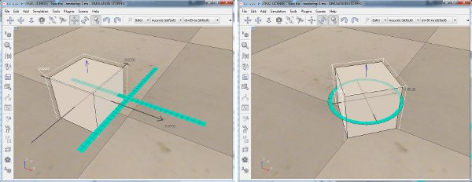

# Переміщення об'єкта за допомогою мишк #
Крім зміни конфігурацій [об’єктів](https://www.coppeliarobotics.com/helpFiles/en/objects.htm) за допомогою [діалогового вікна координат і трансформації](https://www.coppeliarobotics.com/helpFiles/en/coordinateDialog.htm), об’єктами також можна керувати напряму за допомогою миші: коли об’єкти (і деякі елементи) вибрано, їх можна перемістити або повернути за допомогою таких кнопок панелі інструментів:

.jpg)

[Кнопки панелі інструментів маніпуляції (положення та орієнтація)]

За замовчуванням трансляція виконується у світовій площині X-Y. Його також можна виконати вздовж іншої осі/площини та відносно іншої системи відліку для кожного окремого об’єкта, залежно від налаштувань у [діалоговому вікні позиції](https://www.coppeliarobotics.com/helpFiles/en/positionDialog.htm). Блакитне накладання вказує на поточну площину або вісь трансляції.

За замовчуванням обертання виконується навколо власної осі Z об’єкта. Його також можна виконати навколо іншої осі або відносно іншої системи відліку для кожного окремого об’єкта, залежно від налаштувань у [діалоговому вікні орієнтації](https://www.coppeliarobotics.com/helpFiles/en/orientationDialog.htm). Блакитний накладений малюнок вказує на поточну вісь обертання.

[Операції переміщення та обертання об’єкта за допомогою миші: блакитний малюнок накладання вказує на площину переміщення або вісь обертання]

Стандартні розміри кроку переміщення та обертання (прив’язування) можна налаштувати в [діалоговому вікні налаштувань користувача](https://www.coppeliarobotics.com/helpFiles/en/settings.htm), але рекомендується зберігати значення 5 сантиметрів і 5 градусів відповідно або встановлювати розміри кроку для об’єктів на індивідуальній основі. Прив’язку можна тимчасово вимкнути, утримуючи натиснутою клавішу Shift **ПІСЛЯ** натискання кнопки миші під час маніпулювання об’єктом. Подібним чином альтернативні осі переміщення або обертання можна тимчасово активувати, утримуючи натиснутою клавішу ctrl **ПІСЛЯ** того, як кнопку миші було натиснуто під час маніпулювання об’єктом.
Кнопку панелі інструментів перекладу об’єкта/елемента також можна використовувати, коли симулятор знаходиться в [режимі редагування вершин](https://www.coppeliarobotics.com/helpFiles/en/vertexEditMode.htm).
