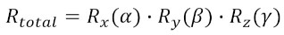

# Про позиції, орієнтації та трансформації #
У CoppeliaSim є багато різних способів отримати, встановити або працювати з позиціями та орієнтаціями. У цьому посібнику користувача використовується така номенклатура:
+ Позиція: три координати (x,y,z), що представляють позицію в 3D-просторі. Положення може бути абсолютним (тобто відносно світового кадру) або відносно конкретного кадру.
+ Орієнтація: орієнтація в тривимірному просторі, яку можна вказати як *кути Ейлера*, *кватерніон* або *матрицю обертання*. Орієнтація може бути абсолютною (тобто відносно світової рамки) або відносно конкретної рамки.
+ Рамка відліку: також називається просто *трансформацією* або *рамкою*, вона представляє позицію та орієнтацію в 3D-просторі. Його можна вказати як матрицю перетворення, позу або як позицію та орієнтацію. Система відліку може бути абсолютною (тобто відносно світової системи) або відносною іншої системи відліку.
## Кути Ейлера ##
Кути Ейлера — це три кути, які описують поворот, орієнтацію твердого тіла або орієнтацію рами. Існує дванадцять різних умов, коли говорять про кути Ейлера. Їх можна згрупувати в **правильні кути Ейлера** та **кути Тейта-Брайана**, де останні представляють обертання навколо трьох різних осей. У CoppeliaSim використовуються **кути Тейта-Брайана** *альфа*, *бета* та *гамма* (або (a,b,g)), що описують обертання, яке складається з трьох елементарних обертань:

[Конвенція про кути Ейлера в CoppeliaSim]
де Rz, Ry і Rx представляють елементарні повороти навколо осей Z, Y і X відповідно (у цьому порядку) **абсолютної** системи відліку.
Для твердого тіла або об’єкта сцени ви можете отримати таке ж перетворення, якщо обертати його в такому порядку навколо **власної** системи відліку: обертання *альфа* навколо власного x, за яким слід обертання *бета* навколо власного y, а потім обертання *гама* про власну з.
**Yaw-Pitch-Roll** також є **кутами Тейта-Брайана**, що описують обертання, що складається з трьох елементарних обертань:

