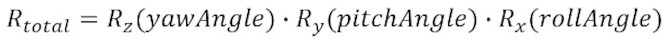
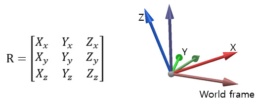
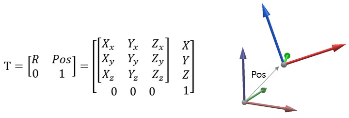

# Про позиції, орієнтації та трансформації #
У CoppeliaSim є багато різних способів отримати, встановити або працювати з позиціями та орієнтаціями. У цьому посібнику користувача використовується така номенклатура:
+ Позиція: три координати (x,y,z), що представляють позицію в 3D-просторі. Положення може бути абсолютним (тобто відносно світового кадру) або відносно конкретного кадру.
+ Орієнтація: орієнтація в тривимірному просторі, яку можна вказати як *кути Ейлера*, *кватерніон* або *матрицю обертання*. Орієнтація може бути абсолютною (тобто відносно світової рамки) або відносно конкретної рамки.
+ Рамка відліку: також називається просто *трансформацією* або *рамкою*, вона представляє позицію та орієнтацію в 3D-просторі. Його можна вказати як матрицю перетворення, позу або як позицію та орієнтацію. Система відліку може бути абсолютною (тобто відносно світової системи) або відносною іншої системи відліку.
## Кути Ейлера ##
Кути Ейлера — це три кути, які описують поворот, орієнтацію твердого тіла або орієнтацію рами. Існує дванадцять різних умов, коли говорять про кути Ейлера. Їх можна згрупувати в **правильні кути Ейлера** та **кути Тейта-Брайана**, де останні представляють обертання навколо трьох різних осей. У CoppeliaSim використовуються **кути Тейта-Брайана** *альфа*, *бета* та *гамма* (або (a,b,g)), що описують обертання, яке складається з трьох елементарних обертань:

[Конвенція про кути Ейлера в CoppeliaSim]
де Rz, Ry і Rx представляють елементарні повороти навколо осей Z, Y і X відповідно (у цьому порядку) **абсолютної** системи відліку.

Для твердого тіла або об’єкта сцени ви можете отримати таке ж перетворення, якщо обертати його в такому порядку навколо **власної** системи відліку: обертання *альфа* навколо власного x, за яким слід обертання *бета* навколо власного y, а потім обертання *гама* про власну з.
**Yaw-Pitch-Roll** також є **кутами Тейта-Брайана**, що описують обертання, що складається з трьох елементарних обертань:

[Обертання Yaw-Pitch-Roll]

де Rx, Ry і Rz представляють елементарні повороти навколо осей X, Y і Z відповідно (у такому порядку) **абсолютної** системи відліку.

Використовуйте такі функції API для перетворення між кутами *альфа-бета-гамма* та кутами *повороту-нахилу-крену*:

+ sim.yawPitchRollToAlphaBetaGamma
+ sim.alphaBetaGammaToYawPitchRoll

## Кватерніони ## 
Кватерніони — це чотири значення, які однозначно описують обертання, орієнтацію твердого тіла або орієнтацію рами. Вони перевершують кути Ейлера кількома способами (наприклад, немає фіксатора кардана), але їх складніше зрозуміти та побудувати. З цієї причини вони ніколи не використовуються в користувацьких інтерфейсах, але надають перевагу під час роботи з орієнтаціями в коді. У CoppeliaSim кватерніони виражаються у вигляді 4-елементної таблиці: (Qx,Qy,Qz,Qw), де (Qx,Qy,Qz) — одиничний вектор осі обертання, помножений на sin(angle/2), а Qw — cos (кут/2), де angle — кут повороту. Наступні функції API можна використовувати для перетворення між кватерніонами, кутами Ейлера та матрицями:

+ sim.buildPose
+ sim.poseToMatrix
+ sim.matrixToPose

## Матриці обертання ##
Матриця обертання — це матриця 3x3, яка описує обертання, орієнтацію твердого тіла або орієнтацію рами:

[Матриця обертання в 3D просторі]

У наведеній вище матриці одиничні вектори (Xx, Xy, Xz), (Yx, Yy, Yz) і (Zx, Zy, Zz) представляють осі X, Y і Z системи відліку відповідно. У CoppeliaSim матриці обертання виражаються у вигляді таблиці з 9 елементів у порядку старших рядків: (Xx,Yx,Zx,Xy,Yy,Zy,Xz,Yz,Zz). Дивіться також такі функції API, пов’язані з матрицями обертання:

+ sim.buildMatrix
+ sim.poseToMatrix
+ sim.getEulerAnglesfromMatrix
+ sim.getRotationAxis
+ sim.rotateAroundAxis

## Матриці перетворення ##

Матриця перетворення — це матриця 4x4, яка описує перетворення кадр-кадр у 3D-просторі. Перші 3x3 елементи матриці представляють матрицю обертання:

[Матриця перетворення в 3D просторі]

У CoppeliaSim матриці перетворення представлені у вигляді таблиці з 12 елементів у порядку старших рядків (останній рядок опущено): (Xx,Yx,Zx,X,Xy,Yy,Zy,Y,Xz,Yz,Zz,Z ). Дивіться також такі функції API, пов’язані з матрицями обертання:

+ sim.buildMatrix
+ sim.poseToMatrix
+ sim.matrixToPose
+ sim.getEulerAnglesfromMatrix
+ sim.getRotationAxis
+ sim.rotateAroundAxis
+ sim.multiplyMatrices
+ sim.multiplyVector
+ sim.interpolateMatrices
+ sim.invertMatrix

## Пози ##
Пози — це значення, які описують перетворення кадру в 3D-просторі. У CoppeliaSim пози виражаються як таблиця з 7 елементів: (X, Y, Z, Qx, Qy, Qz, Qw), тобто позиція, за якою слідує кватерніон. Дивіться також такі функції API, пов’язані з позами:

+ sim.buildPose
+ sim.poseToMatrix
+ sim.matrixToPose
+ sim.getRotationAxis
+ sim.rotateAroundAxis
+ sim.multiplyPoses
+ sim.multiplyVector
+ sim.interpolatePoses
+ sim.invertPose
