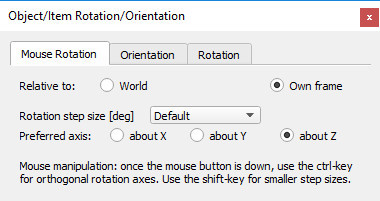

# Діалогове вікно орієнтації #
Діалогове вікно орієнтації стає видимим, коли на панелі інструментів вибрано кнопку обертання об’єкта:
 
 
 
[Кнопка панелі інструментів обертання об’єкта]
Діалогове вікно має три окремі вкладки:
## Обертання миші ##

[Вкладка повороту миші]

У цьому розділі діалогового вікна можна встановити параметри обертання об’єктів, якими керуєте мишею. Дивіться також сторінку про переміщення об'єктів за допомогою миші.

+ **Відносно світової/власної рамки:** вказує на те, що перетягування мишею обертатиме вибраний об’єкт навколо осі абсолютної системи відліку або власної системи відліку об’єкта.
+ **Розмір кроку обертання:** розмір кроку, який використовується під час обертання вибраного об’єкта за допомогою перетягування мишею (розмір кроку за замовчуванням див. у діалоговому вікні налаштувань користувача). Менший розмір кроку все ще можна використовувати під час маніпулювання, натиснувши клавішу Shift **після** натискання кнопки миші.
+ **Бажана вісь: навколо X/ навколо Y/ відносно Z:** вказує на те, що перетягування мишею дозволяє обертати вибраний об’єкт навколо бажаної осі базової рамки, вибраної вище. Інші осі можна використовувати під час маніпулювання, натиснувши клавішу ctrl **після** натискання кнопки миші.
