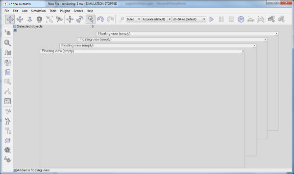

# Сторінки та перегляди #
Сторінка в CoppeliaSim є основною поверхнею перегляду сцени. Це не безпосередньо представлення, але може містити одне, два або скільки завгодно подання. Перегляд — це те, що використовується для відображення вмісту зображення певного об’єкта, який має бути доступним для перегляду. Наприклад, якщо перегляд пов’язаний з об’єктом камери, він може відображати те, що бачить камера. На наступному малюнку пояснюється взаємозв’язок сторінки, перегляду та видимого об’єкта:

[Відношення сторінки, перегляду та видимого об’єкта]

Подання може мати фіксоване положення на сторінці або воно може мати плаваюче положення на сторінці. Відношення вищевказаної сторінки, подання та доступного для перегляду об’єкта показано в такій конфігурації сторінки:

[Конфігурація сторінки, що містить чотири перегляди. Один вид фіксований (фоновий вигляд), інші три види плаваючі]

Кожна сцена в CoppeliaSim має вісім вільно настроюваних сторінок. Окремі сторінки можна отримати (тобто відобразити) за допомогою кнопки вибору сторінок на панелі інструментів:

[Кнопка панелі інструментів вибору сторінки]

Коли створюється нова сцена, кожна з 8 сторінок буде попередньо налаштована іншим способом. Сторінку можна видалити за допомогою [Спливне меню --> Видалити сторінку]. Неіснуюча сторінка (тобто видалена сторінка) відображає темно-сіру поверхню. Потім можна створити сторінку та конфігурацію сторінки за замовчуванням із порожніми видами за допомогою [Спливне меню --> Сторінка налаштування з...]. Доступні кілька конфігурацій сторінок, як показано на наступному малюнку (цифри позначають індекси перегляду):

[Доступні конфігурації сторінок із фіксованими видами]

Наведені вище конфігурації сторінки дозволяють відображати 1-8 фіксованих переглядів. Кожна зі світло-сірих поверхонь відповідає порожньому виду (тобто неасоційованому виду). У будь-який час сторінку можна видалити за допомогою [Спливне меню --> Видалити сторінку]. Видалення сторінки також призведе до видалення всіх представлень, які вона містить, але не видалить жодного з пов’язаних об’єктів. До наявної конфігурації сторінки можна додати необмежену кількість плаваючих переглядів за допомогою [Спливне меню --> Додати --> Плаваючий перегляд]. На наступному малюнку показано такий приклад:

[Конфігурація сторінки з чотирма плаваючими видами]

Плаваючі види можна зміщувати та змінювати розмір, але не допускати навігації за допомогою лівої чи правої кнопки миші (наприклад, переклад камери, обертання камери тощо). Двічі клацніть плаваюче подання, щоб поміняти його вміст індексом подання 0 (проте цю операцію можна заборонити програмним вимкненням). Щоб видалити плаваюче подання, просто натисніть його кнопку у верхньому правому куті.
Щоб пов’язати видимий об’єкт із видом, виберіть об’єкт і натисніть [Спливне меню --> Перегляд --> Пов’язати перегляд із вибраною камерою] або [Спливне меню --> Перегляд --> Зв’язати перегляд із вибраним датчиком зору] (спливаюче меню автоматично налаштує свій вміст залежно від останнього вибраного об’єкта). Коли подання створено, але ще не пов’язано з видимим об’єктом, команда [Спливне меню --> Додати --> Камера] додасть камеру та безпосередньо пов’яже її з поданням (тобто переглядати через нього). Даний видимий об'єкт може бути пов'язаний з будь-якою кількістю переглядів одночасно.
Крім того, ви також можете пов’язати подання з доступним для перегляду об’єктом, активувавши таке спливаюче вікно в поданні: [Спливне меню --> Перегляд --> Вибір перегляду...]. Це відкриє селектор перегляду.
Після того, як об’єкт перегляду буде пов’язано з представленням, буде відображено вміст його зображення, за винятком датчиків зору, які працюють у такий спосіб: датчик зору повинен генерувати вміст свого зображення, і це може статися лише після виклику відповідної команди API. За замовчуванням основний сценарій містить команду, яка оброблятиме всі датчики зору в сцені ( sim.handleVisionSensor(sim.handle_all) ). Якщо датчик зору не позначено як явно оброблений, але явно не оброблений, його вміст зображення буде згенеровано під час моделювання.
Подання, пов’язане з камерою, можна налаштувати або налаштувати такими способами:
Він може відображати вигляд камери як суцільний, так і каркасний: [Спливне меню --> Перегляд --> Рендеринг Solid]
Він може відображати вигляд камери в режимі перспективи або ортографічної проекції: [Спливне меню --> Перегляд --> Перспективна проекція]
Він може показувати або приховувати краї: [Спливне меню --> Перегляд --> Видимі краї]
Він може відображати краї як товсті або тонкі лінії: [Спливне меню --> Перегляд --> Товсті краї]
Він може вмикати та вимикати відображення текстури: [Спливне меню --> Перегляд --> Текстури форми ввімкнено]
Його пов’язана камера може відстежувати останній вибраний об’єкт: [Спливне меню --> Перегляд --> Відстежити вибраний об’єкт].
