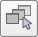
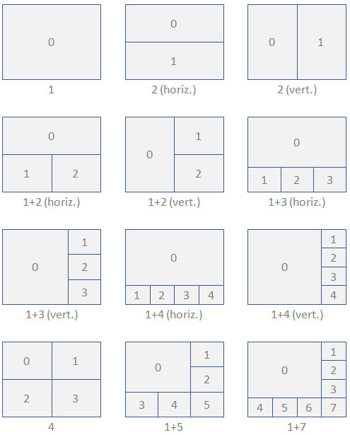

# Сторінки та перегляди #
Сторінка в CoppeliaSim є основною поверхнею перегляду сцени. Це не безпосередньо представлення, але може містити одне, два або скільки завгодно подання. Перегляд — це те, що використовується для відображення вмісту зображення певного об’єкта, який має бути доступним для перегляду. Наприклад, якщо перегляд пов’язаний з об’єктом камери, він може відображати те, що бачить камера. На наступному малюнку пояснюється взаємозв’язок сторінки, перегляду та видимого об’єкта:

[Відношення сторінки, перегляду та видимого об’єкта]

Подання може мати фіксоване положення на сторінці або воно може мати плаваюче положення на сторінці. Відношення вищевказаної сторінки, подання та доступного для перегляду об’єкта показано в такій конфігурації сторінки:

[Конфігурація сторінки, що містить чотири перегляди. Один вид фіксований (фоновий вигляд), інші три види плаваючі]

Кожна сцена в CoppeliaSim має вісім вільно настроюваних сторінок. Окремі сторінки можна отримати (тобто відобразити) за допомогою кнопки вибору сторінок на панелі інструментів:

[Кнопка панелі інструментів вибору сторінки]

Коли створюється нова сцена, кожна з 8 сторінок буде попередньо налаштована іншим способом. Сторінку можна видалити за допомогою [Спливне меню --> Видалити сторінку]. Неіснуюча сторінка (тобто видалена сторінка) відображає темно-сіру поверхню. Потім можна створити сторінку та конфігурацію сторінки за замовчуванням із порожніми видами за допомогою [Спливне меню --> Сторінка налаштування з...]. Доступні кілька конфігурацій сторінок, як показано на наступному малюнку (цифри позначають індекси перегляду):

[Доступні конфігурації сторінок із фіксованими видами]

Наведені вище конфігурації сторінки дозволяють відображати 1-8 фіксованих переглядів. Кожна зі світло-сірих поверхонь відповідає порожньому виду (тобто неасоційованому виду). У будь-який час сторінку можна видалити за допомогою [Спливне меню --> Видалити сторінку]. Видалення сторінки також призведе до видалення всіх представлень, які вона містить, але не видалить жодного з пов’язаних об’єктів. До наявної конфігурації сторінки можна додати необмежену кількість плаваючих переглядів за допомогою [Спливне меню --> Додати --> Плаваючий перегляд]. На наступному малюнку показано такий приклад:
