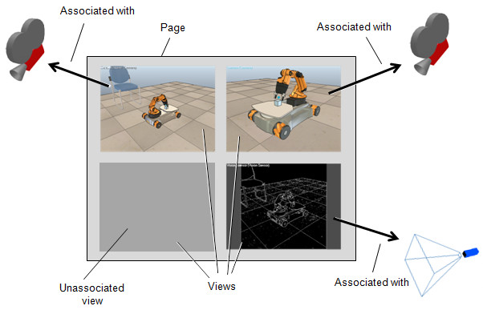
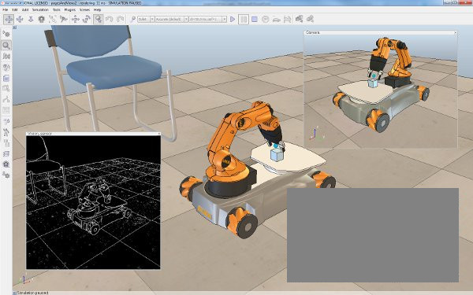

# Сторінки та перегляди #
Сторінка в CoppeliaSim є основною поверхнею перегляду сцени. Це не безпосередньо представлення, але може містити одне, два або скільки завгодно подання. Перегляд — це те, що використовується для відображення вмісту зображення певного об’єкта, який має бути доступним для перегляду. Наприклад, якщо перегляд пов’язаний з об’єктом камери, він може відображати те, що бачить камера. На наступному малюнку пояснюється взаємозв’язок сторінки, перегляду та видимого об’єкта:

[Відношення сторінки, перегляду та видимого об’єкта]

Подання може мати фіксоване положення на сторінці або воно може мати плаваюче положення на сторінці. Відношення вищевказаної сторінки, подання та доступного для перегляду об’єкта показано в такій конфігурації сторінки:

[Конфігурація сторінки, що містить чотири перегляди. Один вид фіксований (фоновий вигляд), інші три види плаваючі]
