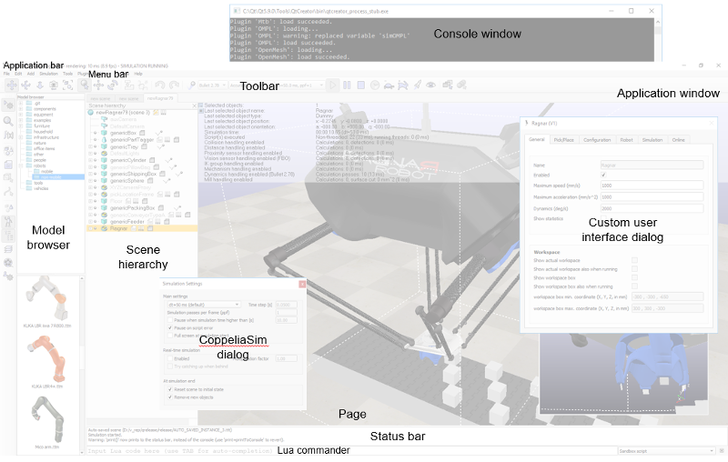

#  Інтерфейс користувача #
Додаток CoppeliaSim складається з кількох елементів. Його основними елементами є:
+ вікно консолі: у Windows, коли запускається програма CoppeliaSim, вікно консолі створюється, але знову приховується. Цю типову поведінку приховування вікна консолі можна змінити в діалоговому вікні налаштувань користувача. У Linux CoppeliaSim потрібно запускати з консолі, яка залишається видимою протягом усього сеансу CoppeliaSim. У MacOSX найкраще запускати CoppeliaSim із терміналу, щоб повідомлення були видимими. У вікні консолі або терміналу відображається, які плагіни було завантажено та чи була успішна процедура їх ініціалізації. Вікно консолі не є інтерактивним і використовується лише для виведення інформації. Користувач може безпосередньо виводити інформацію у вікно консолі за допомогою команди print (зі сценарію) або за допомогою команд C printf або std::cout із плагіна. На додаток до цього, користувач може програмно створювати допоміжні вікна консолі для відображення специфічної інформації, наприклад, для симуляції.
+ вікно програми: вікно програми є головним вікном програми. Він використовується для відображення, редагування, моделювання та взаємодії зі сценою. Ліва та права кнопки миші, колесо миші, а також клавіатура мають певні функції, якщо їх активувати у вікні програми. У вікні програми функції пристроїв введення (миша та клавіатура) можуть відрізнятися залежно від контексту чи місця активації.
+ кілька діалогових вікон: поруч із вікном програми користувач також може редагувати сцену та взаємодіяти з нею, регулюючи параметри діалогу. Кожне діалогове вікно групує набір пов’язаних функцій або функцій, які застосовуються до одного цільового об’єкта. Вміст діалогового вікна може залежати від контексту (наприклад, залежати від стану вибору об’єкта).
Нижче наведено типовий вигляд програми CoppeliaSim:

Елементи інтерфейсу користувача

:——- | :——: | ——: |
Слева | По центру | Справа |
