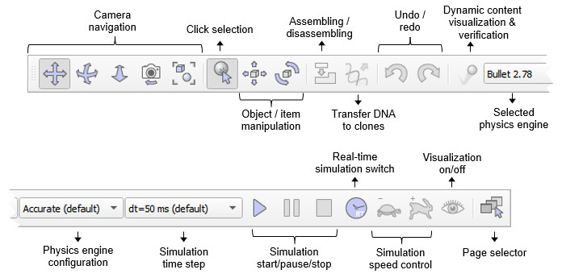

#  Інтерфейс користувача #
Додаток CoppeliaSim складається з кількох елементів. Його основними елементами є:
+ вікно консолі: у Windows, коли запускається програма CoppeliaSim, вікно консолі створюється, але знову приховується. Цю типову поведінку приховування вікна консолі можна змінити в діалоговому вікні налаштувань користувача. У Linux CoppeliaSim потрібно запускати з консолі, яка залишається видимою протягом усього сеансу CoppeliaSim. У MacOSX найкраще запускати CoppeliaSim із терміналу, щоб повідомлення були видимими. У вікні консолі або терміналу відображається, які плагіни було завантажено та чи була успішна процедура їх ініціалізації. Вікно консолі не є інтерактивним і використовується лише для виведення інформації. Користувач може безпосередньо виводити інформацію у вікно консолі за допомогою команди print (зі сценарію) або за допомогою команд C printf або std::cout із плагіна. На додаток до цього, користувач може програмно створювати допоміжні вікна консолі для відображення специфічної інформації, наприклад, для симуляції.
+ вікно програми: вікно програми є головним вікном програми. Він використовується для відображення, редагування, моделювання та взаємодії зі сценою. Ліва та права кнопки миші, колесо миші, а також клавіатура мають певні функції, якщо їх активувати у вікні програми. У вікні програми функції пристроїв введення (миша та клавіатура) можуть відрізнятися залежно від контексту чи місця активації.
+ кілька діалогових вікон: поруч із вікном програми користувач також може редагувати сцену та взаємодіяти з нею, регулюючи параметри діалогу. Кожне діалогове вікно групує набір пов’язаних функцій або функцій, які застосовуються до одного цільового об’єкта. Вміст діалогового вікна може залежати від контексту (наприклад, залежати від стану вибору об’єкта).
Нижче наведено типовий вигляд програми CoppeliaSim:

                                           [Елементи інтерфейсу користувача]
Коли ви запускаєте програму CoppeliaSim, CoppeliaSim ініціалізує одну сцену за замовчуванням. Користувач може вільно відкривати кілька сцен одночасно. Кожна сцена має спільні вікна програми та діалогові вікна з іншими сценами, але лише активний вміст сцени буде видимим у вікні програми чи діалогових вікнах (у певний момент часу відображається лише одна сцена).
У наступному розділі буде надано короткий опис елементів вікна програми. Докладніше про діалогові вікна див. на відповідних сторінках цього довідкового посібника.
+ панель додатків: панель додатків вказує на тип ліцензії вашої копії CoppeliaSim, назву файлу сцени, яка зараз відображається, час, використаний для одного проходу рендерингу (один прохід відображення), і поточний стан симулятора (стан симуляції або тип активного режиму редагування). Панель програми, а також будь-яку поверхню у вікні програми, можна використовувати для перетягування файлів, пов’язаних з CoppeliaSim, на сцену. Підтримувані файли включають файли «*.ttt» (файли сцени CoppeliaSim) і файли «*.ttm» (файли моделі CoppeliaSim).
+ рядок меню: рядок меню дозволяє отримати доступ майже до всіх функцій симулятора. У більшості випадків елементи на панелі меню активують діалогове вікно. Вміст панелі меню є контекстно-залежним (тобто залежатиме від поточного стану симулятора). До більшості функцій панелі меню також можна отримати доступ через спливаюче (меню, що автоматично відкривається) меню, подвійне клацання піктограми в ієрархічному поданні сцени або натискання кнопки на панелі інструментів.
+ панелі інструментів: панелі інструментів містять функції, до яких часто звертаються (наприклад, зміна режиму навігації, вибір іншої сторінки тощо). Доступ до деяких функцій панелі інструментів 1 і всіх функцій панелі інструментів 2 також можна отримати через рядок меню або спливаюче меню. Додаткову інформацію див. нижче. Обидві панелі інструментів можна прикріплювати та роз’єднувати, але прикріплення працює лише з їхніми відповідними початковими позиціями. На наступному малюнку пояснюється функція кожної кнопки панелі інструментів:

[Панель інструментів 1]
