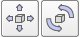

# Маніпуляція позицією/орієнтацією #
Користувач може змінювати положення та орієнтацію об’єкта чи елемента, керувати ними, використовуючи одну з наступних кнопок панелі інструментів:
 

[Кнопки панелі інструментів маніпуляції (положення та орієнтація)]

Перший показує діалогове вікно розташування, а другий відображає діалогове вікно орієнтації. В обох випадках користувач також зможе пересувати вибрані об’єкти або предмети за допомогою миші.
