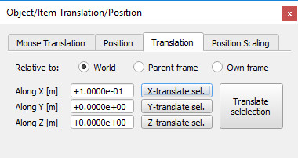
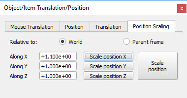

# Діалогове вікно розташування #
Діалогове вікно розташування стає видимим, коли на панелі інструментів вибрано кнопку перекладу об’єкта:

 

[Кнопка панелі інструментів переведення об’єктів]

Діалогове вікно має чотири окремі вкладки:
## Переведення миші ##

[Вкладка переведення мишею]

У цьому розділі діалогового вікна можна встановити параметри переведення об’єктів, якими керують мишею. Дивіться також сторінку про [переміщення об'єктів за допомогою миші](https://www.coppeliarobotics.com/helpFiles/en/objectMovement.htm).

+ **Відносно світової/власної рамки:** вказує на те, що перетягування мишею перемістить вибраний об’єкт на площину чи лінію, яка вирівняна з абсолютною системою відліку або вирівняна з власною системою відліку об’єкта.
+ **Розмір кроку переведення:** розмір кроку, який використовується під час переведення вибраного об’єкта за допомогою перетягування мишею (розмір кроку за замовчуванням див. у [діалоговому вікні налаштувань користувача](https://www.coppeliarobotics.com/helpFiles/en/settings.htm)). Менший розмір кроку все ще можна використовувати під час маніпулювання, натиснувши клавішу Shift **після** натискання кнопки миші.
+ **Бажані осі:** уздовж X/ уздовж Y/ уздовж Z: вказує на те, що перетягування мишею дозволяє перемістити вибраний об’єкт уздовж бажаних осей рамки відліку, вибраної вище. Інші осі можна використовувати під час маніпулювання, натиснувши клавішу ctrl **після** натискання кнопки миші.

## Положення ##

[Вкладка Положення]

У цьому розділі діалогового вікна можна досягти точного позиціонування об’єктів або елементів.

+ **Відносно світової/батьківської системи відліку:** вказує, що координати є відносно абсолютної системи відліку або відносно батьківської системи відліку.
+ **X-/Y-/Z-координата:** положення вибраного об’єкта відносно вказаної системи відліку (світової чи батьківської).

## Переміщення ##

[Вкладка переміщення]

У цьому розділі діалогового вікна можна досягти точного переміщення об’єкта чи елемента.
+ **Відносно світу/батьківського кадру/власного кадру:** вказує на те, що трансляція здійснюватиметься відносно абсолютного опорного кадру, відносно батьківського опорного кадру або відносно власного опорного кадру об’єкта.
+ Переміщення **вздовж X / Y / Z:** вказує на бажану величину переміщення вздовж осей x, y та z зазначеної системи відліку (світової, батьківської або власної).

## Масштабування Положення ##

[Вкладка масштабування позиції]
У цьому розділі діалогового вікна можна досягти точного масштабування позиції об’єкта чи елемента.

+ **Відносно світового/батьківського кадру:** вказує, що масштабування позиції буде відносно абсолютного опорного кадру або відносно батьківського опорного кадру.
+ Масштаб **уздовж X / Y / Z:** вказує на бажане масштабування позиції вздовж осей x, y і z зазначеної системи відліку (світового або батьківського).
