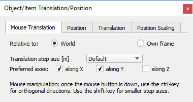
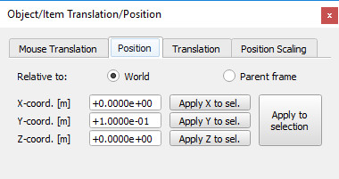

# Діалогове вікно розташування #
Діалогове вікно розташування стає видимим, коли на панелі інструментів вибрано кнопку перекладу об’єкта:

 

[Кнопка панелі інструментів переведення об’єктів]

Діалогове вікно має чотири окремі вкладки:
## Переведення миші ##

[Вкладка перекладу мишею]

У цьому розділі діалогового вікна можна встановити параметри переведення об’єктів, якими керують мишею. Дивіться також сторінку про переміщення об'єктів за допомогою миші.

Відносно світової/власної рамки: вказує на те, що перетягування мишею перемістить вибраний об’єкт на площину чи лінію, яка вирівняна з абсолютною системою відліку або вирівняна з власною системою відліку об’єкта.

Розмір кроку переведення: розмір кроку, який використовується під час переведення вибраного об’єкта за допомогою перетягування мишею (розмір кроку за замовчуванням див. у діалоговому вікні налаштувань користувача). Менший розмір кроку все ще можна використовувати під час маніпулювання, натиснувши клавішу Shift після натискання кнопки миші.

Бажані осі: уздовж X/ уздовж Y/ уздовж Z: вказує на те, що перетягування мишею дозволяє перемістити вибраний об’єкт уздовж бажаних осей рамки відліку, вибраної вище. Інші осі можна використовувати під час маніпулювання, натиснувши клавішу ctrl після натискання кнопки миші.

## Положення ##

[Вкладка Положення]

У цьому розділі діалогового вікна можна досягти точного позиціонування об’єктів або елементів.

Відносно світової/батьківської системи відліку: вказує, що координати є відносно абсолютної системи відліку або відносно батьківської системи відліку.
X-/Y-/Z-координата: положення вибраного об’єкта відносно вказаної системи відліку (світової чи батьківської).

