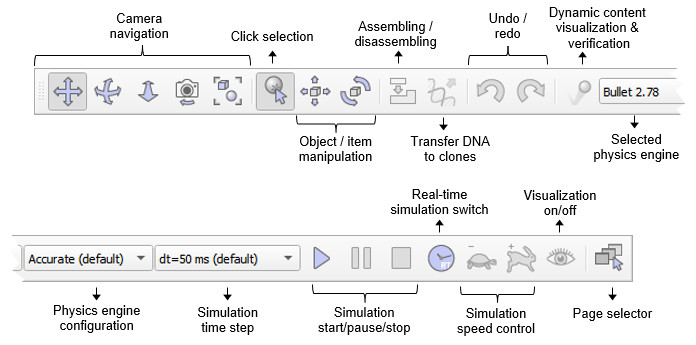
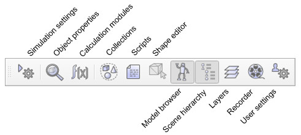
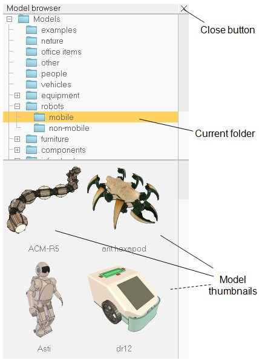

#  Інтерфейс користувача #
Додаток CoppeliaSim складається з кількох елементів. Його основними елементами є:
+ вікно консолі: у Windows, коли запускається програма CoppeliaSim, вікно консолі створюється, але знову приховується. Цю типову поведінку приховування вікна консолі можна змінити в [діалоговому вікні налаштувань користувача](https://www.coppeliarobotics.com/helpFiles/en/settings.htm). У Linux CoppeliaSim потрібно запускати з консолі, яка залишається видимою протягом усього сеансу CoppeliaSim. У MacOSX найкраще запускати CoppeliaSim із терміналу, щоб повідомлення були видимими. У вікні консолі або терміналу відображається, які плагіни було завантажено та чи була успішна процедура їх ініціалізації. Вікно консолі не є інтерактивним і використовується лише для виведення інформації. Користувач може безпосередньо виводити інформацію у вікно консолі за допомогою команди print (зі сценарію) або за допомогою команд C printf або std::cout із плагіна. На додаток до цього, користувач може програмно створювати допоміжні вікна консолі для відображення специфічної інформації, наприклад, для симуляції.
+ вікно програми: вікно програми є головним вікном програми. Він використовується для відображення, редагування, моделювання та взаємодії зі сценою. Ліва та права кнопки миші, колесо миші, а також клавіатура мають певні функції, якщо їх активувати у вікні програми. У вікні програми функції пристроїв введення (миша та клавіатура) можуть відрізнятися залежно від контексту чи місця активації.
+ кілька діалогових вікон: поруч із вікном програми користувач також може редагувати сцену та взаємодіяти з нею, регулюючи параметри діалогу. Кожне діалогове вікно групує набір пов’язаних функцій або функцій, які застосовуються до одного цільового об’єкта. Вміст діалогового вікна може залежати від контексту (наприклад, залежати від стану вибору об’єкта).
Нижче наведено типовий вигляд програми CoppeliaSim:

                                           [Елементи інтерфейсу користувача]
Коли ви запускаєте програму CoppeliaSim, CoppeliaSim ініціалізує одну сцену за замовчуванням. Користувач може вільно відкривати кілька сцен одночасно. Кожна сцена має спільні вікна програми та діалогові вікна з іншими сценами, але лише активний вміст сцени буде видимим у вікні програми чи діалогових вікнах (у певний момент часу відображається лише одна сцена).
У наступному розділі буде надано короткий опис елементів вікна програми. Докладніше про діалогові вікна див. на відповідних сторінках цього довідкового посібника.
+ панель додатків: панель додатків вказує на тип ліцензії вашої копії CoppeliaSim, назву файлу сцени, яка зараз відображається, час, використаний для одного проходу рендерингу (один прохід відображення), і поточний стан симулятора (стан симуляції або тип активного режиму редагування). Панель програми, а також будь-яку поверхню у вікні програми, можна використовувати для перетягування файлів, пов’язаних з CoppeliaSim, на сцену. Підтримувані файли включають файли «*.ttt» (файли сцени CoppeliaSim) і файли «*.ttm» (файли моделі CoppeliaSim).
+ рядок меню: рядок меню дозволяє отримати доступ майже до всіх функцій симулятора. У більшості випадків елементи на панелі меню активують діалогове вікно. Вміст панелі меню є контекстно-залежним (тобто залежатиме від поточного стану симулятора). До більшості функцій панелі меню також можна отримати доступ через спливаюче (меню, що автоматично відкривається) меню, подвійне клацання піктограми в ієрархічному поданні сцени або натискання кнопки на панелі інструментів.
+ панелі інструментів: панелі інструментів містять функції, до яких часто звертаються (наприклад, зміна режиму навігації, вибір іншої сторінки тощо). Доступ до деяких функцій панелі інструментів 1 і всіх функцій панелі інструментів 2 також можна отримати через рядок меню або спливаюче меню. Додаткову інформацію див. нижче. Обидві панелі інструментів можна прикріплювати та роз’єднувати, але прикріплення працює лише з їхніми відповідними початковими позиціями. На наступному малюнку пояснюється функція кожної кнопки панелі інструментів:

[Панель інструментів 1]

[Панель інструментів 2]

+ браузер моделі: браузер моделі відображається за замовчуванням, але його можна перемикати за допомогою відповідної кнопки на панелі інструментів. Він відображає у своїй верхній частині структуру папок моделей CoppeliaSim, а в нижній частині — мініатюри моделей, які містяться у вибраній папці. Мініатюри можна перетягувати в сцену, щоб автоматично завантажити відповідну модель. Зловлені мініатюри виглядають темними, якщо область скидання не підтримується або не підходить.

[Браузер моделі]

+ ієрархія сцени: ієрархія сцени є видимою за умовчанням, але її можна перемикати за допомогою відповідної кнопки на панелі інструментів. Він відображає вміст сцени (тобто всі об’єкти сцени, що складають сцену). Оскільки об’єкти сцени побудовані в ієрархічну структуру, ієрархія сцени відображає дерево цієї ієрархії, а окремі елементи можна розгорнути або згорнути. Подвійне клацання піктограми відкриває/закриває діалогове вікно властивостей, пов’язане з піктограмою, яку клацнули. Подвійне клацання на псевдонімі об'єкта дозволяє редагувати його. Колесо миші, а також перетягування смуг прокручування перегляду ієрархії сцени дозволяє зміщувати вміст вгору/вниз або вліво/вправо. Вибір керування та перемикання завжди підтримується. Об’єкти в ієрархії сцени можна перетягувати на інший об’єкт, щоб створити зв’язок «батько-нащадок». Ієрархія сцен відображатиме інший вміст, якщо симулятор перебуває в режимі редагування. Для отримання додаткової інформації зверніться до режимів редагування форми.

[Ієрархія сцени]

+ сторінка: кожна сцена може містити до 8 сторінок, які можуть містити необмежену кількість переглядів. Сторінку можна розглядати як контейнер для представлень. Щоб отримати докладнішу інформацію, зверніться до розділу сторінок і переглядів.
+ перегляди: на сторінці може бути необмежена кількість переглядів. Подання використовується для відображення сцени (саме містить середовище та об’єкти), видимої крізь видимий об’єкт (наприклад, камери, графіки або датчики зору).
+ інформаційний текст: інформаційний текст відображає інформацію, пов’язану з поточним вибором об’єкта/елемента та поточними станами або параметрами моделювання. Відображення тексту можна перемикати за допомогою однієї з двох маленьких кнопок у верхній лівій частині сторінки. Іншу кнопку можна використовувати для перемикання білого фону, що забезпечує кращий контраст залежно від кольору фону сцени.
+ рядок стану: у рядку стану відображається інформація, пов’язана з виконуваними операціями, командами, а також відображається повідомлення про помилки від інтерпретаторів сценаріїв. Зі сценарію користувач також може виводити рядки в рядок стану або на консоль за допомогою функції sim.addLog. Рядок стану за замовчуванням відображає лише два рядки, але його розмір можна змінити за допомогою маркера горизонтального розділення.
+ Lua commander: цикл читання-оцінки-друку, який додає введення тексту в рядок стану CoppeliaSim, дозволяючи вводити та виконувати код Lua на льоту, як у терміналі. Код можна запустити в сценарії пісочниці або будь-якому іншому активному сценарії в CoppeliaSim.
+ користувацькі інтерфейси: користувальницькі інтерфейси — це визначені користувачем поверхні інтерфейсу користувача, які можна використовувати для відображення інформації (тексту, зображень тощо) або користувацького діалогу, що дозволяє взаємодіяти з користувачем у налаштований спосіб.
+ спливаюче меню: спливаючі меню — це меню, яке з’являється після натискання правої кнопки миші. Щоб активувати спливаюче меню, переконайтеся, що миша не рухається під час операції клацання, інакше може бути активовано режим обертання камери (додаткову інформацію див. у розділі про камеру). Кожна поверхня (пункт, частина) у вікні програми (наприклад, перегляд ієрархії сцени, сторінка, перегляд тощо) може викликати інше спливаюче меню (контекстно-залежне). Вміст спливаючих меню також може змінюватися залежно від поточного стану симуляції або режиму редагування. До більшості функцій спливаючого меню також можна отримати доступ через рядок меню, за винятком пункту меню перегляду, який з’являється лише тоді, коли спливаюче меню активовано на поданні або сторінці.
