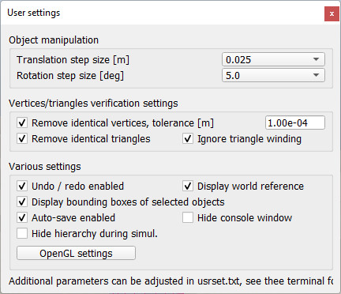
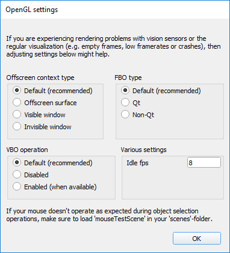

# Налаштування користувача #
Деякі значення та налаштування в CoppeliaSim не залежать від сцени чи моделі, а радше від користувача. Діалогове вікно налаштувань користувача (яке частково відображає вміст файлу *system/usrset.txt*) можна відкрити за допомогою [Панель меню --> Інструменти --> Налаштування] або натиснувши наступну кнопку на панелі інструментів:
 
 
 
[Кнопка панелі інструментів налаштувань]

 
 
 [Діалогове вікно налаштувань користувача]

+ **Розмір кроку перекладу:** лінійний розмір кроку, який використовується під час перекладу об’єктів у режимі маніпулювання об’єктами. Рекомендується зберігати значення 5 см. Об’єктам можна призначити певні розміри кроку в діалоговому вікні координат і трансформації.
+ **Розмір кроку обертання:** розмір кутового кроку, який використовується під час обертання об’єктів у режимі маніпулювання об’єктами. Об’єктам можна призначити певні розміри кроку в діалоговому вікні координат і трансформації.
+ **Видалити ідентичні вершини, допуск:** якщо вибрано, вершини, які лежать поруч з іншими вершинами, будуть згруповані, щоб утворити одну вершину (яка потім буде спільною для навколишніх трикутників). Це зменшує обсяг необхідних ресурсів пам'яті. Цей параметр впливає на сітки, коли вони імпортуються, або на форми, коли виходять із режиму редагування фігур. Допуск визначає поріг відстані, який слід враховувати при групуванні вершин. Загалом, зберігайте низьке значення, але відмінне від нуля: деякі формати даних сіті (наприклад, STL) призначають окремі вершини кожному трикутнику, незалежно від того, чи вершина ідентична іншій вершині в іншому трикутнику; це може значно збільшити необхідний обсяг пам'яті.
+ **Видалити ідентичні трикутники:** якщо вибрано, ідентичні трикутники в ресурсі сітки буде видалено під час операції імпорту або коли фігура виходить із режиму редагування фігури.
+ **Ігноруйте звивання трикутника:** трикутник може мати дві різні орієнтації (оскільки він має дві різні грані). Якщо вибрано цей пункт, орієнтація трикутника ігнорується під час визначення однакових трикутників.
+ **Undo/redo enabled:** вмикає або вимикає функцію скасування/повторення. Ця функція працює шляхом серіалізації (збереження) усієї сцени в пам’яті кожного разу, коли реєструється зміна. Запам’ятовуються лише відмінності від попередніх пунктів скасування, щоб використовувати мало пам’яті. Це дуже ефективне та безпечне скасування/повторення, яке також підтримується плагінами або основною клієнтською програмою, і це дозволено лише тому, що процедури серіалізації CoppeliaSim дуже швидкі. Однак бувають випадки, коли або комп’ютер дуже старий, або вміст сцени надзвичайно великий (наприклад, дуже детальні дані cad), коли цей метод уповільнює роботу всієї програми. У такому випадку просто вимкніть функцію скасування/повторення.
+ **Відображати еталонний світ:** відображає невелику еталонну рамку світу в нижній лівій частині екрана камери. Як і скрізь у CoppeliaSim, червона, зелена та синя стрілки відповідають осям x, y та z відповідно.
+ **Відображати обмежувальні рамки вибраних об’єктів:** відображає білу/жовту обмежувальну рамку навколо вибраних об’єктів
+ **Автоматичне збереження ввімкнено:** коли автозбереження ввімкнено, кожна відкрита сцена буде зберігатися на регулярній основі. У разі збою автоматично збережені сцени можна відновити. Затримку автозбереження можна налаштувати у файлі system/usrset.txt.
+ **Приховати вікно консолі:** дозволяє приховати або показати вікно консолі. За замовчуванням вікно консолі приховане. На Mac цей пункт недоступний (стандартний вивід можна переглянути в системній консолі (Програми/Утиліти/Консоль)).
+ **Приховати ієрархію під час симуляції:** автоматично приховує ієрархію сцени під час симуляції.
+ **Параметри OpenGL:** відкриває діалогове вікно, яке дозволяє налаштувати більшість параметрів, пов’язаних з OpenGL:

Налаштування OpenGL

[Діалогове вікно налаштувань OpenGL]

+ **Тип позакадрового контексту:** тип позакадрових контекстів візуалізації. За замовчуванням невидимі вікна.
+ **Тип FBO:** тип об’єктів буфера кадру. За замовчуванням FBO на основі Qt на Mac і FBO не на основі Qt у Windows і Linux.
+ **Операція VBO:** чи використовуються об’єкти буфера вершин. Параметр **за замовчуванням** використовує VBO.
+ **Idle fps:** кількість кадрів за секунду в режимі очікування.
